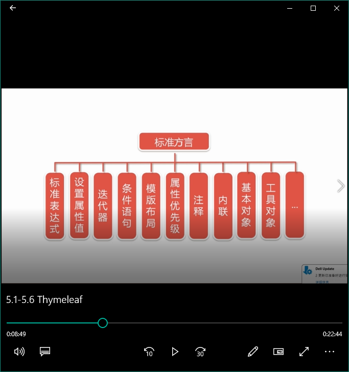

+ 理解Thymeleaf的概念、用法

  - Java模板引擎。能够处理HTML、XML、JavaScript、CSS甚至纯文本。类似JSP、Freemarker
  - 自然模板。原型即页面
  - 语法优雅简单。OGNL、SpringEL表达式
  - 遵从Web标准。支持HTML5

  ###### _Thymeleaf标准方言_

  1. `<span th:text="……">`    
  2. `<span data-th-text="……">`    data前缀用于自定义属性，可以省去引入命名空间

  &emsp;&emsp;Both notations are completely equivalent and interchangeable, but for the sake of simplicity and compactness of the code samples, this tutorial will use the *namespace notation* (`th:*`). Also, the `th:*`notation is more general and allowed in every Thymeleaf template mode (`XML`, `TEXT`…) whereas the `data-`notation is only allowed in `HTML` mode.

  ###### _Thymeleaf命名空间的引入_
  
  `<html xmlns:th="http://www.thymeleaf.org">`

例子：

```html
<p th:text="${name}">
    fskfh
</p>
```

运行时，text标签中的内容会覆盖掉p容器标签包含的内容



##### _变量表达式_

__语法：${…}__

```html
<span th:text="${book.author.name}"></span>
```

##### _消息表达式_

__语法：#{…}__

```html
<table>
    …
    <!-- 消息的一个key -->
    <th th:text="#{header.address.city}">…</th>
    <th th:text="#{header.address.country}">…</th>
    …
</table>
```

+ 也称为文本外部化、国际化或i18n

##### _选择表达式_

__语法：*{…}__

```html
<div th:object="${book}">
    …
    <span th:text="*{title}">…</span>
    …
</div>
```

+ 与变量表达式区别：它们是在当前选择的对象而不是整个上下文变量影身上执行

##### _链接表达式_

__语法：@{…}__

链接表达式可以是相对的，在这种情况下，应用程序上下文将不会作为URL的前提

```html
<a th:href="@{../documents/report}">…</a>
```

也可以是服务器相对（同样，没有应用程序上下文前提）

```html
<a th:href="@{~/contents/main}">…</a>
```

和协议相对（就像绝对URL，但浏览器将使用在显示的页面中使用的相同的HTTP或HTTPS协议）

```html
<a th:href="@{//static.mycompany.com/res/initial}">…</a>
```

当然，Link表达式可以是绝对的

```html
<a th:href="http://www.mucompany.com/main">…</a>
```

##### _分段表达式_

__语法：th:insert或th:replace__

```html
<!doctype html>
<html xmlns:th="http://www.thymeleaf.org">
    <body>
        <div th:fragment="copy">
            &copy;2017<a href="http://www.mucompany.com/main">ddd</a>
        </div>
    </body>
</html>
```

其他地方通过分段表达式实现重用

```html
<div th:insert="~{footer::copy}"><div>
```

##### _字面量(文字)_

__文本:__文本文字只是在<span style="color:red">单引号</span>之间指定的字符串。

```html
<p>
    Now you are looking at a <span th:text="'working web applicatio'">template file</span>
</p>
```

###### _Thymeleaf解析器级别的注释块_

```html
<!--/*-->
<h1 th:text="'加油'">ddddd</h1>
<!--*/-->
```

注意`<!--/*-->`或`<!--*/-->`里面不能存在空格，如果用于注释文本

```html
<!--/* This code will be removed at Thymeleaf parsing time! */-->
```

这种注释文本的情况感觉不如用html自带的`<!-- -->`,感觉有些鸡肋。

###### _原型注释块与th:block标签_

&emsp;&emsp;`th:block`是一个纯粹的属性容器，允许模板开发人员指定他们想要的任何属性，自身没有语义。与原型注释块`<!--/*/`和`/*/-->`标记结合时，可用于处理`<table>`标签中不能包含`<div>`标签的场景。

```html
<table>
    <!--/*/ <th:block th:each="user : ${users}"> /*/-->
    <tr>
        <td th:text="${user.login}">...</td>
        <td th:text="${user.name}">...</td>
    </tr>
    <tr>
        <td colspan="2" th:text="${user.address}">...</td>
    </tr>
    <!--/*/ </th:block> /*/-->
</table>
```


+ Thymeleaf与Spring Boot集成

  修改pom.xml,引入依赖

  ```xml
  <dependency>
  		<groupId>org.springframework.boot</groupId>
  			<artifactId>spring-boot-starter-thymeleaf</artifactId>
  		</dependency>
  ```

  基本设置

  ```yaml
  spring:
    thymeleaf:
      # 设置Thymeleaf的编码格式
      encoding: UTF-8
      # 热部署静态文件
      cache: false
      # 使用HTML5标准
      mode: HTML5
  ```

+ Thymeleaf实战

简单用户管理：增删改查

API设计

+ GET/user：返回用于展现用户列表的list.html页面
+ GET/user/{id}：返回用于展现用户的view.html页面
+ GET/users/form：返回用于新增或者修改用户的form.html
+ POST/users：新增或者修改用户，成功重定向到list.html页面
+ GET/users/delete/{id}：根据id删除相应的用户数据，成功后重定向到list.html页面
+ GET/users/modify/{id}：根据id获取相应用户的用户数据，并返回form.html页面用来执行修改

后台编码

+ 实体User
+ 资源库UserRepository
+ 控制器UserController

dao层要定义一个接口，然后面向接口编程 

前端编码：

- list.html：用于展现用户列表
- form.html：用于新增或者修改用户资料
- view.html：用户查看某个用户的资料
- header.html:共用的头部页面
- footer.html：共用的底部页面