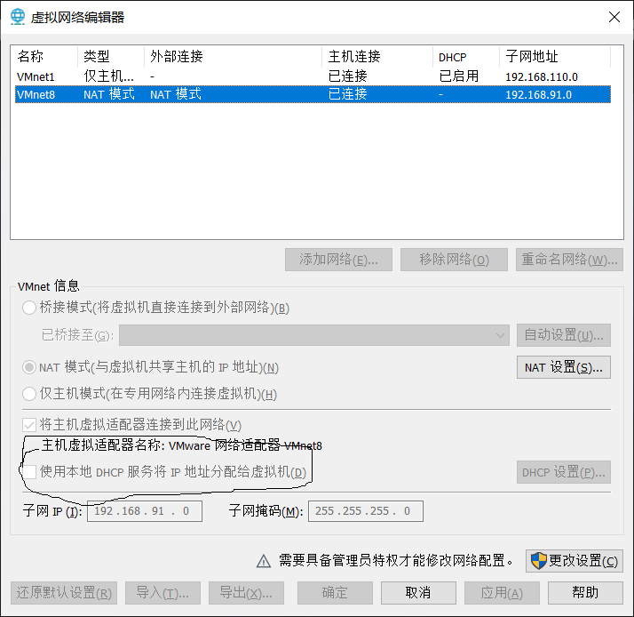

&emsp;&emsp;VMware虚拟机中的Linux镜像系统IP地址在午休重启之后总是由DHCP重新分配，而我们外部的SecureCRT和ftp文件传输工具都是通过IP地址连接到虚拟机的，所以每次都需要手动去修改这些Linux工具的IP地址，次数多了超级烦人！！所以我就想着能不能把虚拟机的IP地址固定下来！！避免变化！！

&emsp;&emsp;下面整理了我设置静态IP地址的全过程，首先虚拟网络编辑器窗口中把这个勾去掉！！



注意：修改配置文件的时候先拷贝一份备份！！！

`cp ifcfg-xxx ifcfg-xxx.bak`

然后修改文件/etc/sysconfig/network-scripts/ifcfg-xxx，这里xxx不是lo是其它的！！xxx貌似是ifconfig上面的ip地址网卡名称！！

```shell
DEVICE="eth0"
BOOTPROTO=static     # 这一行由dhcp改成static
IPV6INIT="yes"
NM_CONTROLLED="yes"
ONBOOT="yes"         # 这一行改成yes
TYPE=Ethernet
DEFROUTE=yes
IPV4_FAILURE_FATAL=yes
IPV6_AUTOCONF=yes
IPV6_DEFROUTE=yes
IPV6_FAILURE_FATAL=no
NAME="System eth0"
UUID=5fb06bd0-0bb0-7ffb-45f1-d6edd65f3e03
HWADDR=00:0C:29:65:61:B5
PEERDNS=yes
PEERROUTES=yes
IPV6_PEERDNS=yes
IPV6_PEERROUTES=yes
# 下面四行都是需要手动添加的，要填的值都可以在虚拟网络编辑器窗口里面找到
IPADDR=192.168.91.129  # 固定IP地址，有限制范围不是随便给的
NETMASK=255.255.255.0  # 子网掩码
GATEWAY=192.168.91.2   # 网关
DNS1=192.168.91.2      # DNS，填和网关一样
```

然后执行命令，"service network restart"重启网络服务


DNS1不配的话可能虚拟机不能访问外网，然后可以ping一下www.baidu.com，ping一下外部主机的IP。用主机的ftp、secureCRT等工具连接测试一下是否出错！！


如果出错就把配置文件删除，把刚才备份的重新用上。然后去虚拟网络编辑器窗口把那个勾勾上。实在还是不行的话就直接去虚拟网络编辑器窗口里面还原网络默认配置！！

不知道为什么全部配置好了下次开机就又出问题了！！下一次找到问题再更新


可以直接改变虚拟机的IP地址，就不用逐个去修改远程连接的地址!!!

`ifconfig eth0 192.168.117.128`