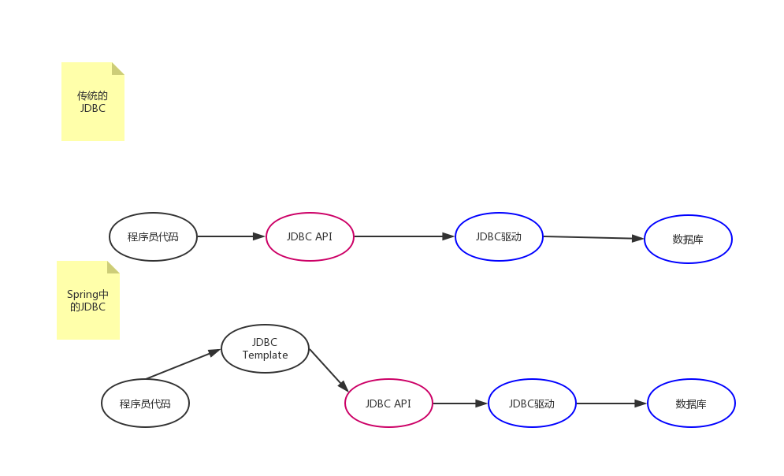

# Spring的核心

&emsp;&emsp;`Spring`的成功来自于<span style="color:blue">理念</span>，而不是技术，它最为核心的理念是`IoC`(控制反转)和`AOP`(面向切面编程)，其中`IoC`是`Spring`的基础，而`AOP`则是其重要的功能，最为典型的当属<u>数据库事务</u>的使用。

### 一、开发步骤

##### 1. 以maven依赖的形式引入Spring开发jar包

```xml
	<!-- https://mvnrepository.com/artifact/org.springframework/spring-core -->
	<dependency>
		<groupId>org.springframework</groupId>
		<artifactId>spring-core</artifactId>
		<version>4.2.4.RELEASE</version>
	</dependency>
	<!-- https://mvnrepository.com/artifact/org.springframework/spring-context -->
	<dependency>
		<groupId>org.springframework</groupId>
		<artifactId>spring-context</artifactId>
		<version>4.2.4.RELEASE</version>
	</dependency>
	<!-- https://mvnrepository.com/artifact/org.springframework/spring-beans -->
	<dependency>
		<groupId>org.springframework</groupId>
		<artifactId>spring-beans</artifactId>
		<version>4.2.4.RELEASE</version>
	</dependency>
	<!-- https://mvnrepository.com/artifact/org.springframework/spring-expression -->
	<dependency>
		<groupId>org.springframework</groupId>
		<artifactId>spring-expression</artifactId>
		<version>4.2.4.RELEASE</version>
	</dependency>
	<!-- https://mvnrepository.com/artifact/commons-logging/commons-logging -->
	<dependency>
		<groupId>commons-logging</groupId>
		<artifactId>commons-logging</artifactId>
		<version>1.2</version>
	</dependency>
	<!-- https://mvnrepository.com/artifact/log4j/log4j -->
	<dependency>
		<groupId>log4j</groupId>
		<artifactId>log4j</artifactId>
		<version>1.2.17</version>
	</dependency>
```

##### 2. 理解IOC控制反转和DI依赖注入

&emsp;&emsp;`IOC(Inverse of Control) ` 反转控制的概念，就是将原本在程序中手动创建对象的控制权，交由 `Spring` 框架管理；简单说，就是创建对象控制权被反转到了 `Spring` 框架。我们通过描述(XML或者注解)并通过IoC容器去产生或获取特定对象的方式。

&emsp;&emsp;`DI(Dependency Injection)` 依赖注入的概念，就是在 `Spring` 创建这个对象的过程中，将这个对象所依赖的属性（也可能是自定义<span style="color:#e7a791">引用类型</span>的属性）注入进去，<span style="color:rgb(255, 68, 68)">从而实现应用对象之间协作关系的协调，让相互协作的软件组件保持松散耦合。</span>



##### 3. 编写Spring的核心配置文件

&emsp;&emsp;Spring默认的配置文件名字 `applicationContext.xml`，在配置文件中用 `<bean></bean>` 标签<span style="color:#0000EE">装配Bean</span>。

注意：Eclipse中可以通过安装sts插件实现自动生成配置文件和Spring相关代码提示的功能。

##### 4. 在程序中读取Spring的配置文件，通过Spring框架获得Bean，完成相应的操作

&emsp;&emsp;在类中通过应用上下文<span style="color:#0000EE">创建和组装对象</span>，如下操作获得类实例。

```java
ApplicationContext applicationContext=new ClassPathXmlApplicationContext("applicationContext.xml");
		Userservice userService=(Userservice)applicationContext.getBean("userService");
```

### 二、SpringBean管理

#### 1. Spring的工厂类

&emsp;&emsp;Spring IoC容器的设计主要是基于`BeanFactory`和`ApplicationContext`两个接口，其中`ApplicationContext``是BeanFactory`的子接口之一，换句话说`BeanFactory`是Spring IoC容器所定义的最底层接口，而`ApplicationContext`是其高级接口之一，并且对`BeanFactory`功能做了许多有用的扩展，所以在绝大部分的工作场景虾，都会使用`ApplicationContext`作为Spring IoC容器。

#### 2. Spring的Bean管理（XML方式）

###### 	2.1 使用类构造器实例化（默认无参数）

```java
/**
*Bean1.java
*/
public class Bean1{
    public Bean1(){}
}
```

配置文件中Bean的装配：

```xml
<!-- applicationContext.xml -->
<bean id="bean1" class="Bean1"></bean>
```

###### 	2.2 使用静态工厂方法实例化（简单工厂模式）

```java
/**
*Bean2.java
*/
public class Bean2{}
/**
*Bean2Factory.java
*/
public class Bean2Factory{
    public static Bean2 createBean2(){
        return new Bean2();
    }
}
```

配置文件中Bean的装配：

```xml
<!-- applicationContext.xml -->
<bean id="bean2" class="BeanFactory" fatory-method="createBean2"></bean>
```

###### 	2.3 使用实例工厂方法实例化（工厂方法模式）

```java
/**
*Bean3.java
*/
public class Bean3{}
/**
*Bean3Factory.java
*/
public class Bean3Factory{
    public Bean3 createBean3(){
        return new Bean3();
    }
}
```

配置文件中Bean的装配：

```xml
<!-- applicationContext.xml -->
<bean id="bean3Factory" class="Bean3Factory"></bean>
<bean id="bean3" factory-bean="bean3Factory" factory-method="createBean3"></bean>
```

------

__Bean的配置__

- __id和name__
  - 一般情况下，装配一个 `Bean` 时，通常指定一个 `id` 属性作为 `Bean` 的名称。
  -  `id` 属性在 `IOC` 容器中必须是唯一的，当然使用过程中也要保证 `name` 唯一（额，还像看其它的书说可以不唯一）。
  - <span style="color:red">如果 `Bean` 的名称中含有特殊字符，就需要使用 `name` 属性</span>，其他情况 `name` 等同于 `id` 。
- __class__
  -  `class` 用于设置一个类的<span style="color:red">完全路径</span>名称，主要作用是`IOC`容器生成类的实例。

__Bean的作用域__（用scope属性指定）

| 类别      | 说明                                                         |
| --------- | ------------------------------------------------------------ |
| singleton | 在SpringIOC容器中仅存在一个Bean实例，Bean以单实例的方式存在（如果没用指定时默认为singleton) |
| prototype | 每次调用getBean()时都会返回一个新的实例                      |
| request   | 每次HTTP请求都会创建一个新的Bean，该作用域仅适用于WebApplicationContext环境 |
| session   | 同一个HTTP Session共享一个Bean，不同的HTTP Session使用不同的Bean。该作用域仅适用于WebApplicationContext环境 |

可以用`==`对比两个对象变量的引用，由此判断是不是同一个对象。

__Spring容器中Bean的生命周期__

spring初始化bean或销毁bean时，有时需要做一些处理工作，因此spring可以在创建和销毁bean的时候调用bean的两个生命周期方法。

```xml
<bean id="xxx" class="...Yoo" init-method="init" destory-method="destory"/>

```

当然初始化和销毁时的方法应该在Bean里面，方法的名字可以自定义。

销毁时的方法有条件，必须是 `scope=singleton` 的情况下才会调用。

调用close()方法销毁应用上下文就可以销毁对象。



start

partition Bean启动 {
:实例化;

:填充属性;

:调用BeanNameAware的setBeanName()方法;

:调用BeanFactoryAware的setBeanFactory()方法;

:调用ApplicationContextAware的setApplicationContext方法;

:调用BeanPostProcessor的预初始化方法;

:调用InitializingBean的afterPropertiesSet()方法;

:调用自定义的初始化方法;

:调用BeanPostProcessor的初始化后方法;

}

partition Bean销毁 {

:调用DisposableBean的destory()方法;

:调用自定义的销毁方法;

}

end




#### 3. Spring的属性注入（XML方式）

+ 对于类成员变量，注入方式有三种：
  1. <span style="color:red">构造方法注入</span>
  2. <span style="color:red">设值注入</span>
  3. 接口注入

+ <span style="color:red">Spring支持前两种</span>

  ##### 构造方法注入

  &emsp;&emsp;通过构造方法注入Bean的属性值或依赖的对象，它保证了Bean实例在实例化后就可以使用。

  &emsp;&emsp;构造器注入到 `<constructor-arg>` 元素里声明的属性。

  ```java
  public class User{
      private String name;
      private Integer age;
      public User(String name,Integer age){
          this.name=name;
          this.age=age;
      }
  }
  ```

  ```xml
  <bean id="user" class="User">
      <constructor-arg name="name" value="张三"/>
      <constructor-arg name="age" value="23"/>
  </bean>
  ```

  ###### c-名称空间

  <span style="color:red">c:<属性名>="xxx" 引入常量值</span>

  <span style="color:red">c:<属性名>-ref="xxx"  引入其它Bean对象</span>
  
  ```xml
  <bean id="user" class="User" c:age="23" c:name="张三">
  </bean>
  ```
  
  ##### 属性setter方法注入
  
  &emsp;&emsp;使用setter方法注入，在Spring配置文件中，通过 `<property>` 设置注入属性。
  
  ```java
  public class Person{
      private String name;
      private Integer age;
      private Cat cat;
      public void setName(String name){
          this.name=name;
      }
      public void setAge(Integer age){
          this.age=age;
      }
    public void setCat(Cat cat){
          this.cat=cat;
      }
  }
  class Cat{
      private String name;
      public void setName(String name){
          this.name=name;
      }
  }
  ```

  ```xml
  <bean class="Cat" id="cat">
      <property name="name" value="ketty"/>
  </bean>
  <bean class="Person" id="person">
      <property name="cat" ref="cat"/>
      <property name="name" value="李四"/>
      <property name="age" value="32"/>
  </bean>
  ```
  
  ###### p-名称空间 属性注入
  
  <span style="color:red">p:<属性名>="xxx" 引入常量值</span>
  
  <span style="color:red">p:<属性名>-ref="xxx"  引入其它Bean对象</span>
  
  ```xml
  <bean class="Cat" id="cat" p:name="ketty">
  <bean class="Person" id="person" p:cat-ref="cat" p:name="李四" p:age="32"/>
  ```
  
  ##### 构造方法和Setter方法属性注入通用
  
  ###### 复杂类型的属性注入
  
  + 数组类型的属性注入
  
    同List集合类型的属性注入
  
  + List集合类型的属性注入
  
    ```xml
        <bean id="helloWorldBean" class="io.github.forhcl.spring.HelloWorldBean" >
            <property name="name">
                <list>
                    <value>12</value>
                    <value>33</value>
                </list>
            </property>
        </bean>
    ```
  
  + Set集合类型的属性注入
  
    ```xml
      <bean id="helloWorldBean" class="io.github.forhcl.spring.HelloWorldBean" >
            <property name="name">
                <set>
                    <value>12</value>
                    <value>33</value>
                </set>
            </property>
        </bean>
    ```
  
  + Map集合类型的属性注入
  
    ```xml
      <bean id="helloWorldBean" class="io.github.forhcl.spring.HelloWorldBean" >
            <property name="name">
                <map>
                    <entry key="12" value="23"></entry>
                </map>
            </property>
        </bean>
    ```
  
  + Properties类型的属性注入(属性类型)
  
    ```xml
      <bean id="helloWorldBean" class="io.github.forhcl.spring.HelloWorldBean" >
            <property name="name">
                <props>
                    <prop key="username">root</prop>
                    <prop key="password">123</prop>
                </props>
            </property>
        </bean>
    ```
  
    
  
  ###### SpEL(Spring expression language) 属性注入
  
  + SpEL：spring expression language，spring表达式语言，对依赖注入进行简化
  
  + 语法：#{表达式}
  
  + `value="#{表达式}"`
  
    ​	SpEL表达式语言
  
    ​		语法：#{}
  
    ​		#{'hello'}:使用字符串
  
    ​		#{beanID}:使用另一个Bean
  
    ​		#{beanId.content.toUpperCase()}:使用指定名属性，并使用方法
  
    ​		#{T(java.lang.Math).PI}:使用静态字段或方法

#### 4. Spring的Bean管理（注解方式）

&emsp;&emsp;

#### 5. Spring的属性注入（注解方式）

#### 6. 自动化装配

&emsp;&emsp;`Spring` 从两个角度来实现自动化装配：

- 组件扫描（component scanning）：`Spring` 会自动发现应用上下文中所创建的 `bean`。

  ###### 相关注解

  `@Component` ：表明该类会作为组件类，并告知 `Spring` 要为这个类创建 `bean`。

  &emsp;&emsp;除了 `@Component` （通用）外，`Spring` 提供了3个功能基本和 `@component` 等效的注解：

  - @Repository 用于对DAO实现类进行标注
  - @Service 用于对Service实现类进行标注
  - @Controller 用于对Controller实现类进行标注

  `@ComponentScan`：会扫描与配置类相同的包，查找带有 `@Component` 注解的类，为其创建一个 `bean`。

- 自动装配：`Spring` 自动满足 `bean` 之间的依赖。

  ###### 相关注解

  `@ContextConfiguration` 加载配置

  `@RunWith()`测试运行器，在测试开始时自动创建Spring的应用上下文

  `@Value("param")` 注入常量值

  `@Autowired` 引入其它的Bean对象，默认<u>按照Java类型匹配</u>；如果存在两个Bean类型相同，则<u>按照名称注入</u>。

  `@Autowired`和`@Qualifier("name")`<span style="color:red">一起使用</span>按指定名称注入其它Bean对象。等同于`@Rresource(name="~")`

  ###### 其它注解

  生命周期注解：

  - @PostConstruct——初始化，相当于XML装配Bean时的init-method属性。当Bean被载入到容器的时候调用。
  - @preDestroy——销毁，相当于XML装配Bean时的destory-method属性。当Bean从容器中删除的时候调用（scope=singleton有效）。

  Bean的作用范围：

  - 使用组件扫描的Bean和 `<bean>` 配置的一样，默认作用范围都是singleton。
  - @Scope注解用于指定Bean的作用范围。

#### 7.Spring的XML和注解整合开发

+ XML方式的优势

  - 结构清晰，易于阅读

+ 注解方式的优势

  - 开发便捷，属性注入方便

+ XML与注解的整合开发(用XML管理类，JavaConfig进行依赖的注入)

  - 1、引入context命名空间
- 2、在配置文件中添加 `context:annotation-config` 标签

------

# Spring事务管理

Java事务导引

+ 什么是事务？
  
  - 事务是<span style="color:red">正确执行</span>一系列的操作（或动作），使得<u>数据库</u>从一种状态转换成另一种状态，且保证操作<span style="color:red">全部成功</span>，或者<span style="color:red">全部失败</span>。
+ 事务的原则性内容
  - 事务必须服从ISO/IEC所制定的ACID原则。
  - <span style="color:red">ACID</span>原则的具体内涵如下：
    + 原子性(Atomicity):即不可分割性，事务要么全部被执行，要么就全部不被执行。
    + 一致性(Consistency):事务的执行使得数据库从一种正确状态转换成另一种正确状态。
    + 隔离性(Isolation):在事务正确提交之前，它可能的结果不应显示给任何其他事务。
    + 持久性(Durability):事务正确提交后，其结果将永久保存在数据库中。

+ 事务与Java的关系

  Java事务的产生

  - 程序操作数据库的需要。在Java编写的程序或系统中，实现ACID的操作。

  Java事务实现范围

  - 通过JDBC相应方法间接来实现对数据库的增、删、改、查，把事务转移到Java程序代码中进行控制；
  - 确保事务——要么全部执行成功，要么撤销不执行。

  <span style="color:red">总结：</span>Java事务机制和原理就是确保数据库操作的ACID特性。

+ Java事务实现模式

  - JDBC：Connection对象控制，包括手动模式和自动模式；
  - JTA（Java Transaction API）事务：<span style="color:red">与实现无关，与协议无关的API</span>
  - 容器事务：应用服务器提供的，且大多是基于JTA完成(通常基于JNDI的，相当复杂的API实现)

  三种事务的差异

  + JDBC事务：控制的局限在一个数据库连接内，但是其使用简单。
  + JTA事务：功能强大，可跨越多个数据库或多个DAO，使用比较复杂。
  + 容器事务：主要指的是J2EE应用服务器提供的事务管理，局限于EJB

Spring事务核心接口

+ 

编程式事务管理

声明式事务管理

事务的最佳实践


# 后端中的Spring

### 一、JDBC Template（简化持久化技术）

#### 课程介绍

- 了解Spring组件JDBC Template
- 能使用JDBC Template进行持久化操作
- 帮助自己学习Hibernate、MyBatis等ORM框架

#### JDBC Template概念

+ 为了简化持久化操作，Spring在JDBC API之上提供了JDBC Template组件，对JDBC API进行二次封装。

  

  

+ JDBC Template提供统一的模板方法，在<span style="color:red">保留代码灵活性</span>的基础上，尽量减少持久化代码。（利用模板消除样板式编程）

  ```java
  //JDBC API
  Statement statement=conn.createStatement();
  ResultSet resultSet=statememt.executeQuery("select count(*) COUNT from student");
  if(resultSet.next()){
      Integer count=resultSet.getInt("COUNT");
  }
  //JDBC Template
  Integer count=jt.queryForObject("select count(*) from student",Integer.class);
  ```

#### 环境配置

+ Maven

  - Mysql驱动

    ```xml
    <!-- https://mvnrepository.com/artifact/mysql/mysql-connector-java -->
    <dependency>
        <groupId>mysql</groupId>
        <artifactId>mysql-connector-java</artifactId>
        <version>5.1.44</version>
    </dependency>
    
    ```

  - Spring组件（`core` `beans` `context` `aop`）

    ```xml
    <!-- 基于AspectJ的AOP环境 -->
        <dependency>
          <groupId>aopalliance</groupId>
          <artifactId>aopalliance</artifactId>
          <version>1.0</version>
        </dependency>
        <dependency>
          <groupId>org.springframework</groupId>
          <artifactId>spring-aop</artifactId>
          <version>4.2.4.RELEASE</version>
        </dependency>
        <dependency>
          <groupId>org.springframework</groupId>
          <artifactId>spring-aspects</artifactId>
          <version>4.2.4.RELEASE</version>
        </dependency>
        <dependency>
          <groupId>org.aspectj</groupId>
          <artifactId>aspectjweaver</artifactId>
          <version>1.8.9</version>
        </dependency>
    <!-- Spring四个核心包 -->
        <!-- https://mvnrepository.com/artifact/org.springframework/spring-core -->
        <dependency>
          <groupId>org.springframework</groupId>
          <artifactId>spring-core</artifactId>
          <version>4.2.4.RELEASE</version>
        </dependency>
        <!-- https://mvnrepository.com/artifact/org.springframework/spring-context -->
        <dependency>
          <groupId>org.springframework</groupId>
          <artifactId>spring-context</artifactId>
          <version>4.2.4.RELEASE</version>
        </dependency>
        <!-- https://mvnrepository.com/artifact/org.springframework/spring-beans -->
        <dependency>
          <groupId>org.springframework</groupId>
          <artifactId>spring-beans</artifactId>
          <version>4.2.4.RELEASE</version>
        </dependency>
        <!-- https://mvnrepository.com/artifact/org.springframework/spring-expression -->
        <dependency>
          <groupId>org.springframework</groupId>
          <artifactId>spring-expression</artifactId>
          <version>4.2.4.RELEASE</version>
        </dependency>
    <!-- 单元测试的两个包 -->
    <dependency>
          <groupId>org.springframework</groupId>
          <artifactId>spring-test</artifactId>
          <version>4.2.4.RELEASE</version>
        </dependency>
    <dependency>
          <groupId>junit</groupId>
          <artifactId>junit</artifactId>
          <version>4.11</version>
          <scope>test</scope>
        </dependency>
    ```

  - JDBC Template（jdbc、tx）

    ```xml
    <!-- https://mvnrepository.com/artifact/org.springframework/spring-jdbc -->
    <dependency>
        <groupId>org.springframework</groupId>
        <artifactId>spring-jdbc</artifactId>
        <version>4.2.4.RELEASE</version>
    </dependency>
    <!-- https://mvnrepository.com/artifact/org.springframework/spring-tx -->
        <dependency>
          <groupId>org.springframework</groupId>
          <artifactId>spring-tx</artifactId>
          <version>4.2.4.RELEASE</version>
        </dependency>
    ```

+ Spring配置

  - 数据源（可以根据生产环境需要选择不同的开源数据源）

  - JDBC Template

    ```java
    package com.imooc.sc;
    
    import org.springframework.context.annotation.Bean;
    import org.springframework.context.annotation.ComponentScan;
    import org.springframework.context.annotation.Configuration;
    import org.springframework.jdbc.core.JdbcTemplate;
    import org.springframework.jdbc.datasource.DriverManagerDataSource;
    
    import javax.sql.DataSource;
    
    /**
     * @author Hogan_Lee
     * @create 2019-07-20 17:43
     */
    @ComponentScan
    @Configuration
    public class Config {
        @Bean
        public DataSource dataSource(){
            DriverManagerDataSource ds=new DriverManagerDataSource();
            ds.setDriverClassName("com.mysql.jdbc.Driver");
            ds.setUsername("root");
            ds.setPassword("mysql");
            ds.setUrl("jdbc:mysql://localhost:3306/customer?useUnicode=true&amp;characterEncoding=utf-8");
            return ds;
        }
        @Bean
        public JdbcTemplate jdbcTemplate(){
            return new JdbcTemplate(dataSource());
        }
    }
    ```

注意:url中的&为特殊字符，需要写成`&amp;`;

#### 基本操作

+ execute方法

  可以执行任何sql语句，实际应用中主要用来执行DDL语句。实际应用中用的不多。

+ <span style="color:red">update与batchUpdate方法</span>

  对数据进行增删改操作（DML操作）。

  - update方法:对数据进行增 `insert` 删 `delete` 改 `update` 操作

    ```java
    //返回值:影响的数据行数
    //Object[] args参数:对sql语句中的占位符进行填充
    int update(String sql,Object[] args)
    int update(String sql,Object... args)
    ```

  - batchUpdate方法:批量增删改操作

    ```java
    int[] batchUpdate(String[] sql)
    //执行同构sql语句，每次执行的占位符不同
    int[] batchUpdate(String sql,List<Object[]> args)
    ```

+ <span style="color:red">query与queryXXX方法</span>

  对数据进行查询

  + 查询简单数据项

    - 获取一个

      ```java
      T queryForObject(String sql,Class<T> type)
      T queryForObject(String sql,Object[] args,Class<T> type)
      T queryForObject(String sql,Class<T> type,Object... arg)
      ```

    - 获取多个

      ```java
      List<T> queryForList(String sql,Class<T> type)
      List<T> queryForList(String sql,Object[] args,Class<T> type)
      List<T> queryForList(String sql,Class<T> type,Object... arg)
      ```

  + 查询复杂对象（封装为Map）

    - 获取一个

      ```java
      Map queryForMap(String sql)
      Map queryForMap(String sql,Object[] args)
      Map queryForMap(String sql,Object... arg)
      ```

    - 获取多个

      ```java
      List<Map<String,Object>> queryForList(String sql)
      List<Map<String,Object>> queryForList(String sql,Object[] args)
      List<Map<String,Object>> queryForList(String sql,Object...arg)
      ```

  + 查询复杂对象（封装为实体对象）

    - RowMapper接口
    - 获取一个

    ```java
    T queryForObject(String sql,RowMapper<T> mapper)
    T queryForObject(String sql,Object[] args,RowMapper<T> mapper)
    T queryForObject(String sql,RowMapper<T> mapper,Object... arg)
    ```

    - 获取多个

    ```java
    List<T> query(String sql,RowMapper<T> mapper)
    List<T> query(String sql,Object[] args,RowMapper<T> mapper)
    List<T> query(String sql,RowMapper<T> mapper,Object... arg)
    ```

    

+ call方法

  调用存储过程

  ------

  ```java
  import com.imooc.sc.User;
  import org.junit.runner.RunWith;
  import org.springframework.jdbc.core.JdbcTemplate;
  import org.springframework.jdbc.core.RowMapper;
  import org.springframework.test.context.ContextConfiguration;
  import org.springframework.test.context.junit4.SpringJUnit4ClassRunner;
  
  import javax.annotation.Resource;
  import java.sql.ResultSet;
  import java.sql.SQLException;
  import java.util.ArrayList;
  import java.util.List;
  import java.util.Map;
  
  /**
   * @author Hogan_Lee
   * @create 2019-07-18 11:31
   */
  @RunWith(SpringJUnit4ClassRunner.class)
  @ContextConfiguration(locations = "classpath:applicationContext.xml")
  public class Test {
      @Resource
      private JdbcTemplate jdbcTemplate;
  
      @org.junit.Test
      public void textExcute() {
          jdbcTemplate.execute("create table user1(id int,name varchar(20))");
      }
  
      @org.junit.Test
      public void testUpdate() {
          jdbcTemplate.update("update user1 set name='5' where id=?", 1);
      }
  
      @org.junit.Test
      public void testBatchUpdate() {
          String[] sqls = {
                  "insert into user1(id,name) value(2,'7')",
                  "update user1 set name='9' where id=2",
          };
          jdbcTemplate.batchUpdate(sqls);
      }
  
      @org.junit.Test
      public void testBatchUpdate1() {
          String sql = "insert into user1(id,name) value(?,?)";
          List<Object[]> list = new ArrayList<>();
          list.add(new Object[]{7, "8"});
          list.add(new Object[]{5, "6"});
          jdbcTemplate.batchUpdate(sql, list);
      }
  
      @org.junit.Test
      public void testQuerySimple1() {
          String sql = "select count(*) from user1";
          int count = jdbcTemplate.queryForObject(sql, Integer.class);
          System.out.println(count);
      }
  
      @org.junit.Test
      public void testQuerySimple2() {
          String sql = "select name from user1 where id=1";
          List<String> names = jdbcTemplate.queryForList(sql, String.class);
          System.out.println(names);
      }
  
      @org.junit.Test
      public void testQueryMap1() {
          String sql = "select * from user1 where id=?";
          Map<String, Object> user7 = jdbcTemplate.queryForMap(sql, 7);
          System.out.println(user7);
      }
  
      @org.junit.Test
      public void testQueryMap2() {
          String sql = "select * from user1 where id=?";
          List<Map<String, Object>> user1 = jdbcTemplate.queryForList(sql, 1);
          System.out.println(user1);
      }
  
      @org.junit.Test
      public void testQueryEntity() {
          String sql = "select * from user1 where id=?";
          User user = jdbcTemplate.queryForObject(sql, new UserRowMapper(), 7);
          System.out.println(user);
      }
  
      @org.junit.Test
      public void testQuery() {
          String sql = "select * from user1 where id=?";
          List<User> users = jdbcTemplate.query(sql, new UserRowMapper(), 1);
          System.out.println(users);
      }
  
      private class UserRowMapper implements RowMapper<User> {
  
          @Override
          public User mapRow(ResultSet resultSet, int i) throws SQLException {
              User user = new User();
              user.setId(resultSet.getInt("id"));
              user.setName(resultSet.getString("name"));
              return user;
          }
      }
  }
  ```

#### JDBC Template持久层示例

+ 实体类entity：定义属性和对应的getter和setter方法
+ DAO：继承统一的接口，实现增删改查。实现对象的持久化
  - 注入JDBC Template
  - 声明RowMapper，查询的时候映射为对象。

#### 优缺点介绍

+ 优点：
  - 简单
  - 灵活
+ 缺点
  - SQL与Java代码参杂
  - 功能不丰富

所以实际应用当中还需要使用更加完善的ORM框架，如mybatis或者hibernate。


