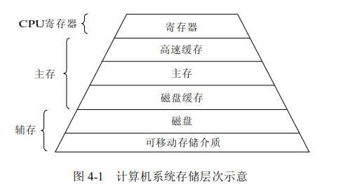

&emsp;&emsp;近年来，随着硬件技术和生产水平的提高，存储器的成本迅速下降，容量一直在不断地扩大，但仍然不能满足各种软件对存储空间急剧增长的需求，因此，存储器仍然是一种宝贵而紧俏的资源，如何对其进行有效的管理，不仅直接影响存储器的利用率，而且对系统性能也有重大影响。

&emsp;&emsp;众所周知，计算机在执行程序的时候，每条指令都是在CPU中执行的，而执行的时候，又免不了要和数据打交道。而计算机上面的程序及其要访问的数据往往是存放在内存中。刚开始，还相安无事的，但是随着CPU技术的发展，CPU的执行速度越来越快。从**内存中读取和写入数据的速度**开始跟不上**CPU的执行速度**，两者的差距越来越大，这导致CPU每次操作内存都要耗费很多的等待时间。

&emsp;&emsp;可是吧，我们总不能因为内存拖后腿就暂停发展CPU，等待内存技术赶上来吧！为了解决CPU和存储器之间速度上的不匹配，就在CPU和内存之间设置了高速缓存存储器；高速缓冲存储器相比较主存而言有以下特点：价格昂贵，容量小，速度快。其工作原理就是将CPU频繁访问的数据保存一份拷贝在高速缓冲存储器中，将大多数的CPU和主存之间的交互转换为CPU与高速缓冲存储器之间的交互，从而在整体上提高系统的性能。由于高速缓存的速度越高价格也越贵，因此目前的计算机系统中多设置两级或多级高速缓存。两级缓存比一级缓存速度慢，但容量更大，主要用作一级缓存和内存之间数据临时交换的地方。



在多级存储结构中，在储存层次中越往上，存储介质的访问速度越快，价格也越高，相对存储容量也越小。CPU寄存器、主存掉电后其存储的信息不再存在，属于操作系统存储管理的讨论范畴；辅存属于操作系统设备管理的范畴，其存储的信息会长期保存。

