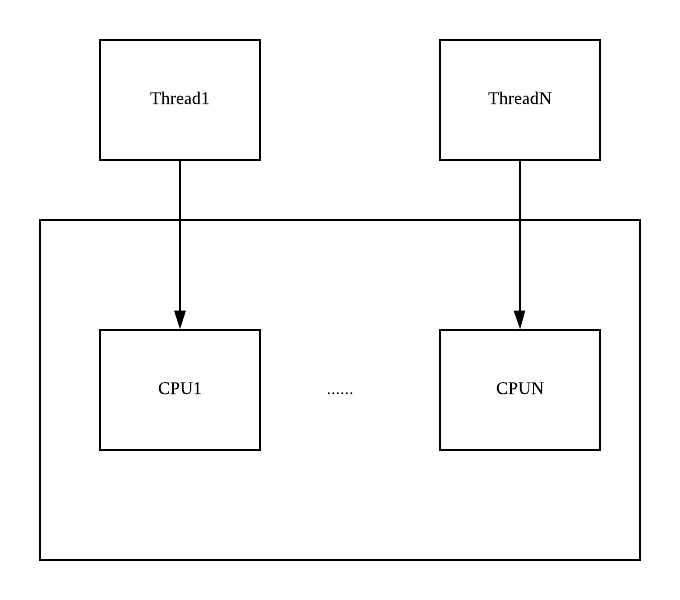
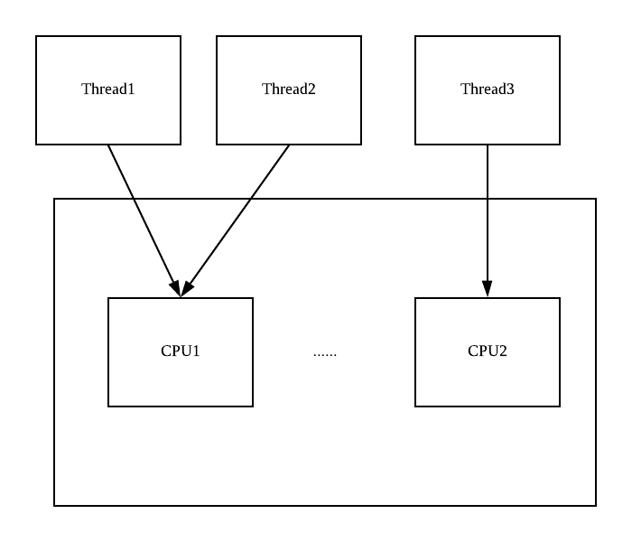

操作系统是一组管理与控制计算机软硬件资源(资源管理角度)并对各项任务进行合理化调度且附加了各种便于用户操作(用户角度)的工具的软件层次。

定义：操作系统是一组管理与控制计算机软硬件资源(资源管理角度)并对各项任务进行合理化调度且附加了各种便于用户操作(用户角度)的工具的软件层次。

特征：并发性、共享性、异步性、虚拟性。其中并发性是最基本的特性，后面3个特性均基于并发性而存在。

+ 并发性

  并发：在一个时间段内发生了**一个以上**的事件，则称这几个事件具有并发性。

  并行：**多个事件**在同一时刻点发生。

  （并行的事件一定是并发的，反之则不然）

  在单处理机的系统中，每一个特定的时刻只能有一个程序在CPU中运行。但是在一个较长的时间段可以被分为多个小的时间碎片，这些碎片可以按照一定的原则发放给多个不同的程序，使得在这个时间段内有多个程序得到一定程度的执行。单核情况下，多个程序交替执行，骗过肉眼，让我们误认为他们是同时执行，这些程序具有并行性，但不具有并发性。

  在多处理机的情况下，平时我们都说多线程并发编程，很少说多线程并行编程，这是为什么呢？我们先从概念上来看看两者的区别，所谓并行是指同一时刻一起执行，如下图，N个线程，分别占用各自的CPU进行执行。

  

  

  所谓并发执行是指多个任务走走停停，交叉占用同一个CPU来执行，如下图中，Thread1和Thread2轮流使用CPU1进行任务处理，也就是同时单个CPU只在执行一个线程上面的任务，当Thread1的时间片用完后会进行线程上下文切换，也九四保存当前Thread1的执行上下文，然后切换到Thread2占用CPU运行任务。

  

  

  在平时的生产环境中，应用中开启的线程个数往往多于机器配置的CPU个数，因此我们一般称多线程并发编程而不是多线程并行编程。

  综上所述，并行必然是需要多核的，一个处理器是无法并行的，但并发和处理器并没有什么必然联系。

+ 共享性

  操作系统中的共享指的是多个并发执行的程序按照一定的规则共同使用操作系统所管理的软硬件资源。

  同时访问方式——宏观的一个“时间段”共享，微观上可能是顺序或交替执行。

  互斥访问方式——对于临界资源的访问。

+ 异步性

  操作系统中各个程序的推进顺序无法预知。

+ 虚拟性

  依靠分时共享方法和多道程序设计技术，操作系统将计算机体系结构中的各种物理设备映射为多个逻辑设备，将一个设备的能力均分到不同的逻辑设备上，以便多用户共享资源。虚拟方法不会造成多个用户长期等待其他用户操作完成，同时也能够极大地提高资源利用率。

  例如，在一段时间内，CPU将分时间片处理多个程序请求，但提出这些请求的各个用户并不会感觉到有其他人和自己共用CPU时间，而是感觉自己独占了资源，在当今硬件能力快速发展时期，这种方法能够最大限度地发挥联网机器的效用，从而提高处理效率。