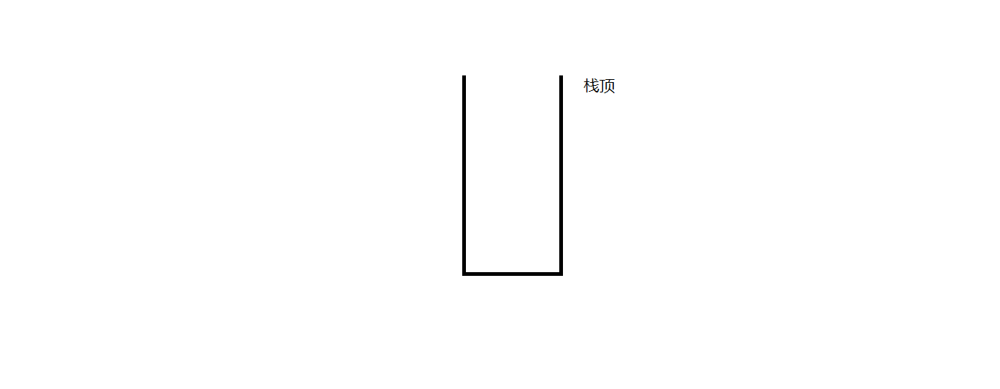

---

title: 栈和队列
date: 2019-07-26 17:32:59
tags:
categories: 数据结构
---

# 栈 Stack

+ 栈也是一种线性结构

+ 相比数组，栈对应的操作是数组的子集

+ 只能从一端添加元素，也只能从同一端取出元素

+ 这一端称为栈顶

  

栈是一种后进先出的数据结构Last In First Out（LIFO）

在计算机的世界里，栈拥有着不可思议的作用

__栈的应用__

+ 无处不在的Undo:`ctrl+z`、Redo:`ctrl+y`

+ 程序调用的系统栈，在方法里面调用其他的方法

  另外，栈还用来存放线程的调用栈帧，那么什么是栈帧呢？如下代码，当我们调用 test() 方法时，就会把<span style="color:red">当前方法的一些信息封装为栈帧</span>(如方法中断执行到跳转其它方法的位置)压入到栈顶，栈顶的栈帧就是活跃的 test 方法。当执行到 say() 方法时就会在栈顶新加一个关于 say() 方法的栈帧，这时候 say() 方法所在栈帧就是活跃栈帧。当 say() 方法执行完毕后，say() 方法所在的栈顶帧就会出栈，这时候栈顶活跃帧就是 test 方法的了。

  ```java
  void test(int x,int y) {
      int a = 5;
      int b = 6;
      say();
  }
  ```

  __栈的基本实现__(实际底层有多种实现方式)
  
  ```java
  package stack;
  
  /**
   * @author Hogan_Lee
   * @create 2019-07-26 18:17
   * 栈
   */
  public interface Stack<E> {
      /**
       * 入栈
       */
      void push(E e);
  
      /**
       * 出栈
       *
       * @return
       */
      E pop();
  
      /**
       * 取栈顶元素
       *
       * @return
       */
      E peek();
  
      /**
       * 查看栈里面元素个数
       *
       * @return
       */
      int getSize();
  
      /**
       * 判断栈是否为空
       *
       * @return
       */
      boolean isEmpty();
  }
  ```
  
  ```java
  
  ```
  
  