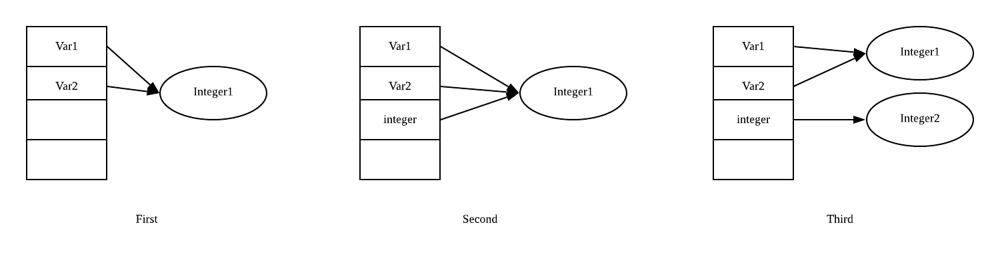

##### Java的参数传递是“按值传递”还是“按引用传递”？

+ 值传递：在调用函数时将实际参数复制一份传递到函数中，这样在函数中如果对参数进行修改，将不会影响到实际参数。
+ 引用传递：在调用函数时将实际参数的地址传递到函数中，那么在函数中对参数所进行的修改，将影响到实际参数。

```java
import com.sun.org.apache.xerces.internal.dom.PSVIAttrNSImpl;

/**
 * 以下程序运行的结果是：
 * @author Hogan_Lee
 * @create 2019-12-18 10:17
 */
public class Tester {
    public static void main(String[] args) {
        Integer var1=new Integer(1);
        Integer var2=var1;
        doSomething(var2);
        System.out.print(var1.intValue());
        System.out.print(var2==var1);
    }
    public static void doSomething(Integer integer){
        integer=new Integer(2);
    }
}
/**
 * A 1true  B 2true  C 1false  D 2false
 * 正确答案为A
 * 如果还是不明白就再去ide中debug一下，看一下运行流程
 */
```

分析上例，可以得出如下图的结果。<span style="color:red">当传入引用类型的变量作为参数时，是将引用类型中存储的实例对象地址复制一份传递给形参，实参和形参指向同一个实例对象。</span>当对对象进行修改时，形参和实参都会发生改变，但是当形参指向一个新的对象的时候，实参并不会发生改变。可见，Java的引用类型和基本类型一样都是值传递，并不存在引用传递。



##### import关键字的导入范围？

`import java.util.*` 只能读取其目录下的类，不能读取其子目录下的类。

因为其根目录和子目录下可能有同名类，若都能读取，则会混淆。